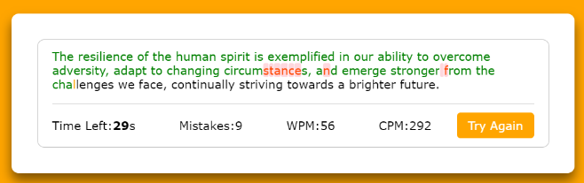

# Typing Test Web App

## Description
A web-based typing test application that allows users to test their typing speed. The app calculates **Words Per Minute (WPM)**, **Characters Per Minute (CPM)**, and accuracy based on real-time input. Users type randomly selected paragraphs to assess their typing skills.

The app is built using **HTML**, **CSS**, and **JavaScript**. Future versions will include additional features like levels, user authentication, and progress tracking.

## Demo
Check out the live demo of the app [here](https://arnavdeepaware-typing-test.netlify.app/).

## Features
- **Typing Test**: Users can test their typing speed with real-time calculation of WPM, CPM, and mistakes.
- **Random Paragraphs**: The app picks random paragraphs for each test.
- **Real-Time Feedback**: Displays accuracy, mistakes, and typing speed as the user types.

### Future Development:
- **Levels**: Add beginner, intermediate, and advanced difficulty levels.
- **User Authentication**: Allow users to create accounts and track progress.
- **Database Integration**: Store user data and progress in a connected database.
- **Dashboard**: Create a dashboard to visualize user statistics and progress.
- **Custom Text**: Let users input their own text to practice typing.
  
## Screenshots


## Installation

### Prerequisites
- A modern web browser

### Running the App Locally
1. Clone the repository:
   ```
   git clone https://github.com/username/typing-test-app.git
   cd typing-test-app
   ```
2. Run the html file:
```
start index.html
```

## Usage
- Load the web app.
- Start typing the displayed text in the input field.
- The app will display your WPM, CPM, mistakes, and the time left as you type.
- Press the Try Again button to reset the test and try again.
